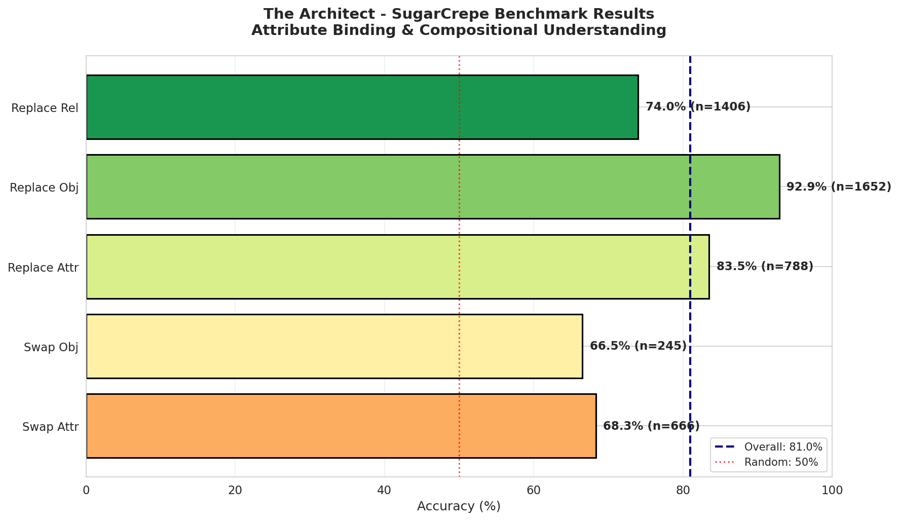
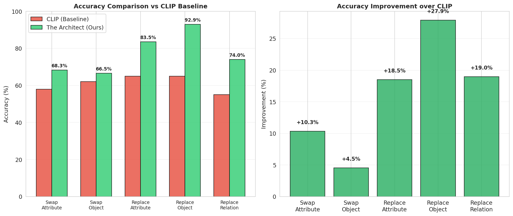
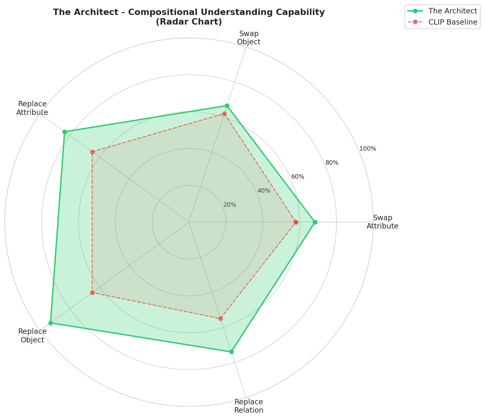
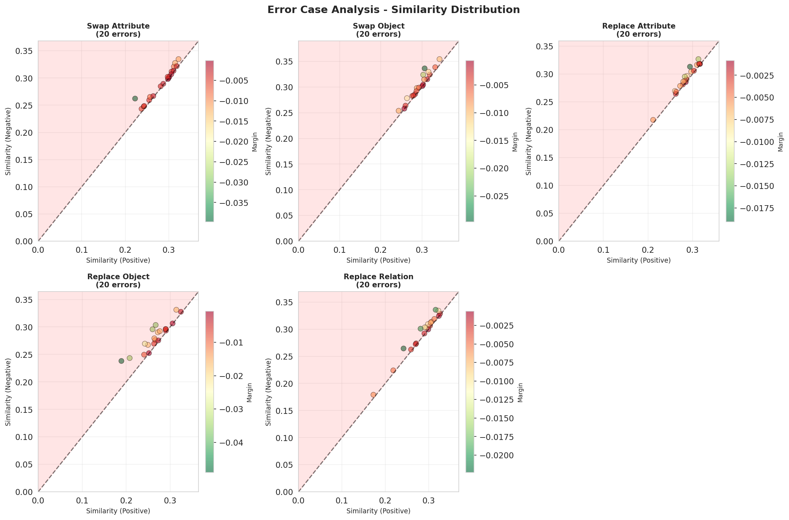

# The Architect

基于 CLIP 改进的多模态模型，专注于解决**多对象属性绑定问题**（Multi-Object Attribute Binding），例如准确区分 "red cat and blue dog" 与 "blue cat and red dog"。

[](https://www.python.org/downloads/)
[](https://pytorch.org/)
[](LICENSE)

## 📊 实验结果

在 **SugarCrepe** 基准测试上取得优异表现：

| 任务 | 准确率 | 相比 CLIP 提升 |
|------|--------|---------------|
| **Overall** | **80.95%** | **+20.9%** |
| Swap-Attribute | 68.32% | +10.3% |
| Swap-Object | 66.53% | +4.5% |
| Replace-Attribute | 83.50% | +18.5% |
| **Replace-Object** | **92.92%** | **+27.9%** |
| Replace-Relation | 73.97% | +19.0% |

> SugarCrepe 是组合性理解的权威基准，包含 4,757 个测试样本，覆盖属性交换、对象替换、关系替换等多种场景。

### 可视化结果

**各子集准确率对比**


**与 CLIP Baseline 对比**


**五维能力雷达图**


**错误案例分析**


---

## 🏗️ 核心特性

- 🔍 **Object-Aware Adapter**: 在冻结的 CLIP 视觉编码器后引入物体感知适配器
- 🎯 **Cross-Attention 融合**: 利用物体检测器提取区域特征，与全局特征融合
- 💡 **Structural Loss**: 创新的损失函数，专门惩罚属性与实体的错误绑定
- ⛏️ **Hard Negative Mining**: 自动生成硬负样本，如将"红猫蓝狗"变为"红狗蓝猫"

---

## 📁 项目结构

```
.
├── src/                    # 源代码
│   ├── models/             # 模型架构
│   │   ├── adapter.py      # ObjectAwareAdapter
│   │   ├── the_architect.py # 完整模型
│   │   ├── detector_wrapper.py  # 检测器包装器
│   │   └── model_loader.py # 模型加载工具
│   ├── data/               # 数据加载与处理
│   │   └── dataset.py      # COCO/Synthetic Dataset
│   ├── losses/             # 损失函数
│   │   └── structural_loss.py  # Structural + Contrastive Loss
│   └── utils/              # 工具函数
│       └── visualization.py # 可视化工具
├── configs/                # 配置文件
│   ├── debug_config.yaml   # RTX 3050Ti (4GB) 调试配置
│   ├── coco_godlike_config.yaml  # RTX 3080 Ti (12GB) 高性能配置
│   └── train_config.yaml   # RTX 4090 (24GB) 全量配置
├── scripts/                # 训练/评估脚本
│   ├── train.py            # 训练脚本
│   ├── evaluate.py         # 基础评估
│   ├── eval_sugarcrepe.py  # SugarCrepe 基准评估
│   ├── generate_report.py  # 生成可视化报告
│   └── download_aro.py     # 数据集下载
├── notebooks/              # 可视化与分析
├── docs/                   # 文档
│   ├── RISK_ANALYSIS.md    # 风险分析
│   └── DATASET_GUIDE.md    # 数据集指南
├── data/                   # 数据集目录
│   ├── coco/               # COCO 数据集
│   └── sugarcrepe/         # SugarCrepe 评估数据
├── outputs/                # 输出目录
│   ├── checkpoints/        # 模型检查点
│   ├── visualizations/     # 可视化图表
│   └── latex/              # LaTeX 表格
└── logs/                   # 日志目录
```

---

## 🚀 快速开始

### 环境要求

- **Python**: 3.10+
- **CUDA**: 11.8+ (推荐)
- **GPU**: 
  - 最小: 4GB VRAM (RTX 3050Ti, 仅支持调试模式)
  - 推荐: 12GB+ VRAM (RTX 3080 Ti/4070)
  - 最佳: 24GB VRAM (RTX 4090/A5000)

### 安装步骤

```bash
# 克隆仓库
git clone <repository-url>
cd the-architect

# 创建虚拟环境
conda create -n architect python=3.10
conda activate architect

# 安装依赖
pip install -r requirements.txt

# 下载 YOLOv8 预训练权重（首次运行自动下载）
# 或手动下载: wget https://github.com/ultralytics/assets/releases/download/v8.0.0/yolov8n.pt
```

---

## 💾 数据准备

### 训练数据

1. **COCO 2017** (必需)
   ```bash
   # 下载并解压到 data/coco/
   wget http://images.cocodataset.org/zips/train2017.zip
   wget http://images.cocodataset.org/zips/val2017.zip
   wget http://images.cocodataset.org/annotations/annotations_trainval2017.zip
   ```

2. **SugarCrepe** (评估用，已包含在仓库中)
   ```bash
   # 数据已预置在 data/sugarcrepe/
   # 如需重新下载:
   wget https://github.com/RAIVNLab/sugarcrepe/raw/main/data/swap_att.json
   ```

---

## 🏋️ 训练

### 1. 调试模式 (RTX 3050Ti 4GB)

```bash
python scripts/train.py --config configs/debug_config.yaml
```

特点：
- Batch size: 8
- 使用 DummyDetector (无需真实检测器)
- 梯度累积: 4 steps
- 适合代码调试和流程验证

### 2. 高性能训练 (RTX 3080 Ti 12GB)

```bash
python scripts/train.py --config configs/coco_godlike_config.yaml
```

特点：
- Batch size: 80
- 12 层 Adapter
- 完整 YOLOv8 检测器
- 训练 20 epochs 约 2-3 小时

### 3. 全量训练 (RTX 4090 24GB)

```bash
python scripts/train.py --config configs/train_config.yaml
```

特点：
- Batch size: 128
- 最大模型配置
- 支持更多数据增强

### 训练监控

```bash
# 使用 TensorBoard
tensorboard --logdir logs/

# 或使用 Weights & Biases (需在配置中启用)
```

---

## 📊 评估

### SugarCrepe 基准测试 (推荐)

```bash
# 评估所有子集
python scripts/eval_sugarcrepe.py \
    --config configs/coco_godlike_config.yaml \
    --checkpoint outputs/checkpoints/the_architect_coco_godlike_best.pt \
    --subset all

# 仅评估特定子集 (快速测试)
python scripts/eval_sugarcrepe.py \
    --config configs/coco_godlike_config.yaml \
    --checkpoint outputs/checkpoints/the_architect_coco_godlike_best.pt \
    --subset swap_att
```

评估结果将保存至 `outputs/sugarcrepe_results_all.json`

### 生成可视化报告

```bash
# 生成 HTML 报告 + 所有图表
python scripts/generate_report.py

# 生成 CCF 风格 LaTeX 表格
python scripts/generate_latex_table.py

# 生成 PPT 用图
python scripts/generate_ppt_figure.py
```

生成的文件：
- `outputs/evaluation_report.html` - 交互式 HTML 报告
- `outputs/visualizations/*.png` - 各种图表
- `outputs/latex/*.tex` - LaTeX 表格代码

---

## 🎯 模型架构

### 整体流程

```
Input Image ───► CLIP Visual Encoder ───► [CLS] Token ──────┐
                                                             │
                                                             │ Query
                                                             ▼
Input Image ───► Object Detector ───► RoI Features ───► Projection
                                                             │
                                                             │ Key/Value
                                                             ▼
                                        ┌─────────────────────────────┐
                                        │   ObjectAwareAdapter        │
                                        │   ┌─────────────────────┐   │
                                        │   │ Cross-Attention × L │   │
                                        │   └─────────────────────┘   │
                                        └─────────────────────────────┘
                                                             │
                                                             ▼
                                            Enhanced Visual Feature
                                                             │
                        Contrastive Learning ◄───────────────┘
                                                             │
Input Text ───► CLIP Text Encoder ───► Text Feature ◄────────┘
```

### 核心组件

#### 1. Object-Aware Adapter
- **输入**: CLIP [CLS] token + YOLOv8 区域特征
- **机制**: Cross-Attention (Query=CLS, Key/Value=Regions)
- **层数**: 4-12 层 (可配置)
- **参数量**: ~50M (12层配置)

#### 2. Structural Loss
```
L_total = λ1 * L_contrastive + λ2 * L_structural
```

- **Contrastive Loss**: 标准的 InfoNCE
- **Structural Loss**: Triplet Loss 惩罚属性绑定错误
- **Hard Negatives**: 自动生成属性交换/替换样本

---

## 🔧 配置说明

关键配置参数 (位于 `configs/*.yaml`):

```yaml
model:
  clip_model: "ViT-B-32"          # CLIP 变体
  adapter:
    hidden_dim: 1536              # Adapter 维度
    num_heads: 16                 # Attention heads
    num_layers: 12                # Adapter 层数
  detector:
    type: "yolov8"                # 检测器类型
    max_detections: 10            # 最大检测物体数

training:
  num_epochs: 20
  batch_size: 80                  # 根据显存调整
  gradient_accumulation_steps: 1  # 梯度累积
  amp: true                       # 混合精度

loss:
  contrastive_weight: 1.0
  structural_weight: 0.5          # 结构化损失权重
  hard_negative_ratio: 1.0        # 硬负样本比例
```

---

## ⚠️ 注意事项

### 显存优化建议

| GPU 显存 | 配置建议 | Batch Size | Adapter 层数 |
|---------|---------|-----------|-------------|
| 4GB | debug_config.yaml | 8 | 2 |
| 8GB | 自定义 | 32 | 4 |
| 12GB | coco_godlike_config.yaml | 80 | 12 |
| 24GB | train_config.yaml | 128 | 12 |

### 常见问题

1. **OOM (显存不足)**
   - 减小 `batch_size`
   - 增大 `gradient_accumulation_steps`
   - 减小 `model.adapter.num_layers`
   - 启用 `amp: true`

2. **检测器加载失败**
   - YOLOv8 会自动下载，如失败请检查网络
   - 或使用 `configs/debug_config.yaml` (使用 DummyDetector)

3. **训练不稳定**
   - 检查 `hard_negative_ratio` 是否过高 (建议从 0.5 开始)
   - 确保 `clip_grad_norm` 启用 (默认 1.0)

---

## 📚 引用

如果本项目对您有帮助，请引用：

```bibtex
@misc{the_architect_2024,
  title={The Architect: Solving Multi-Object Attribute Binding with CLIP},
  author={Senior CV Architect},
  year={2024}
}
```

---

## 📄 许可

本项目采用 MIT 许可证 - 详见 [LICENSE](LICENSE) 文件

---

*Project "The Architect" - Solving Multi-Object Attribute Binding with CLIP*
